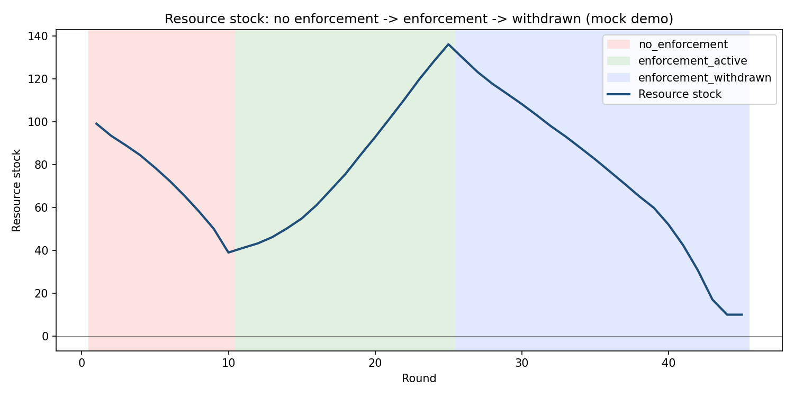

# Agentic Governance Simulator

A multi-agent LLM simulation, orchestrated with **LangGraph** and running on **local models
via Ollama**, that models a group of AI agents sharing a depleting resource — and studies
what happens to their cooperation when a peer-enforcement (punishment) system is introduced,
and then quietly withdrawn.



*Mock-mode demo run: unrestrained extraction depletes the shared resource, a peer-enforcement
mechanism lets it recover, and removing enforcement mid-simulation sends it back into decline.*

## What this demonstrates

- **Multi-agent orchestration with LangGraph** — each simulation round is a small state
  graph (`decide → settle → regenerate`) driving N independent LLM agents.
- **Local LLM agents via Ollama** — agents run entirely on local models (`qwen2.5:7b`,
  `llama3:8b`, `mistral:7b`), no API keys or cloud calls required.
- **Config-driven experiments** — swap agent populations, environment parameters, and
  phase schedules entirely through YAML, no code changes needed.
- **A genuinely runnable, zero-dependency demo mode** (`--mock`) — anyone cloning this
  repo can see the full three-phase dynamic in under a second, without a GPU or Ollama
  installed, using heuristic agents standing in for LLMs.
- **A research extension already scaffolded**: `configs/uniform.yaml` (all agents on one
  model) vs `configs/mixed.yaml` (agents on different models) — set up to test whether a
  heterogeneous agent population destabilizes self-governance faster than a uniform one,
  a question not addressed by existing multi-agent-governance literature (GovSim, PAVE,
  CRSEC), which studies single-model-family populations only.

## Experimental design

A shared "fishery": N agents each round decide how much of a shared, regenerating resource
to extract. The simulation runs in three phases:

1. **No enforcement** — agents extract freely, no punishment mechanism exists.
2. **Enforcement active** — agents can vote to fine peers who over-extract beyond an agreed
   sustainable cap.
3. **Enforcement withdrawn** — the fine mechanism is silently removed; agents are not told.

Two conditions:
- **Uniform**: all agents run the same local model (e.g. all `qwen2.5:7b`).
- **Mixed**: agents run different local models (e.g. `qwen2.5:7b`, `llama3:8b`, `mistral:7b`).

Metrics logged every round: total extraction, resource stock, per-agent extraction,
sanctions issued, and (in phase 3) rounds-to-collapse — the round where resource stock
first drops below a sustainability threshold after enforcement ends.

## Repo layout

```
src/simulation/
  agent.py         # LLM-backed agent: decides extraction amount + votes on sanctions
  environment.py   # resource pool dynamics (regrowth, depletion, sustainability threshold)
  enforcement.py   # peer-sanctioning logic, active/inactive toggle
  graph.py         # LangGraph StateGraph wiring one round together
  run_experiment.py# CLI entry point: loads a config, runs N rounds, logs to CSV/JSON
configs/
  uniform.yaml
  mixed.yaml
results/           # experiment output (csv logs), gitignored by default except .gitkeep
notebooks/
  analysis.ipynb   # placeholder for plotting compliance decay curves
```

## Quickstart (no GPU needed)

```bash
pip install -r requirements.txt
python src/simulation/run_experiment.py --config configs/mock_demo.yaml --out results/mock_demo.csv --mock
python src/simulation/plot_results.py --csv results/mock_demo.csv --out results/mock_demo.png
```

## Running with real local LLMs

Requires Ollama running locally with the relevant models pulled:

```bash
ollama pull qwen2.5:7b && ollama pull llama3:8b && ollama pull mistral:7b

python src/simulation/run_experiment.py --config configs/uniform.yaml --out results/uniform_run1.csv
python src/simulation/run_experiment.py --config configs/mixed.yaml   --out results/mixed_run1.csv
python src/simulation/plot_results.py --csv results/uniform_run1.csv --out results/uniform_run1.png
```

Run each condition multiple times (LLM outputs are stochastic) before drawing conclusions —
5-10 runs per condition is a reasonable starting point given local GPU time.

## Environment design notes

The resource pool follows logistic regrowth (`growth = rate * stock * (1 - stock/capacity)`)
with a small **refuge population** that is never harvestable. Without a refuge, the pool
can hit exactly zero and then mathematically can never regrow, since logistic growth from
zero is always zero — a realistic-looking but uninteresting failure mode. The refuge keeps
the system dynamic enough to show recovery and re-collapse across phases.

## Project layout

See `src/simulation/` for the environment, enforcement, agent, and orchestration code, and
`configs/` for the three ready-to-run scenarios (`mock_demo`, `uniform`, `mixed`).

## Status

Core simulation is implemented, tested, and runs end to end (see `results/mock_demo.png`
for a real output). Next steps: run the real-LLM `uniform` vs `mixed` conditions with
several repeats each, and add an analysis notebook comparing rounds-to-collapse across
conditions.
